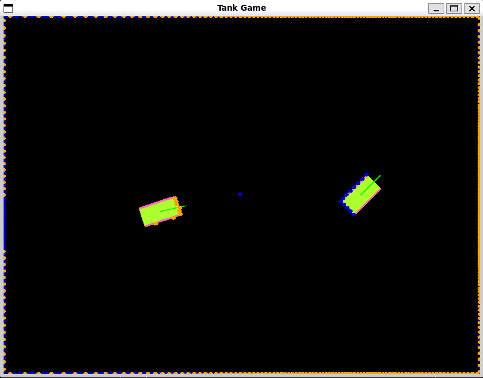

# Tank Game Environment



## Goal
This project aims to develop a deep reinforcement learning agent skilled enough to beat human opponents in a 2D tank battle simulation.

## Methodology
The 'Tank Game' consists of two or more tanks attempting damage the other by firing projectiles.

Each tank is equipped with a lidar scanner that provides 360° distance measurements.

Each tank is capable of movement by adjusting power delivered to the tread motors, and is able to position it's gun by adjusting power delivered to the turret motor.

## Future Work
- Adding random obstacles
- Allow for tanks to be grouped into teams

## Repository Contents

```
tank_environment
├── .devcontainer                   [ Docker related configuration files ]
├── .github                         [ GitHub related configuration files ]
├── .gitignore
├── .pre-commit-config.yaml
├── .vscode                         [ VSCode related configuration files ]
├── CMakeLists.txt
├── README.md
├── include                         [ CPP header files ]
├── python                          [ Python files ]
├── requirements.txt
├── setup.sh
├── src                             [ CPP source files ]
└── test                            [ CPP unit tests ]
```

## Additional Documentation
- [**Tank Game Environment**](python/tank_game_environment/README.md)
- [**Tank Game Agent**](python/tank_game_agent/README.md)

## Building

1. Clone and enter the repository:
    ```
    git clone git@github.com:kennedyengineering/tank_evironment.git
    cd tank_environment
    ```

2. Configure with CMake
    ```
    cmake -B build .
    ```

3. Build with CMake
    ```
    cmake --build build
    ```

## Running Tests

### CPP Tests

- Run CPP unit tests with CTest
    ```
    ctest --test-dir build
    ```

### Python Tests

- Run Python unit tests with PyTest
    ```
    pytest
    ```

## Misc.

### WSL2 Notes
- Starting docker daemon in WSL2 cannot be done inside VSCode Terminal. Open a different terminal and enter `sudo service docker start`.
- Using development container expects Docker to be installed on Windows. To use the docker installed in WSL2, set `Dev › Containers: Execute In WSL` to `true` in `Settings`.
